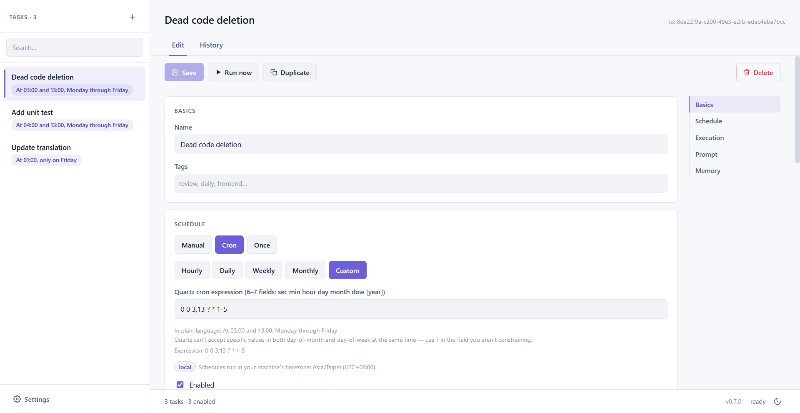

# opencode runner（繁體中文）

[English](README.md) | **繁體中文**



一款輕量的桌面應用程式,用來**排程並執行 [opencode](https://opencode.ai) 任務** —— 支援 cron 排程、一次性執行與手動觸發,並提供乾淨的介面來編輯提示詞、即時觀看輸出、瀏覽執行歷史,以及閱讀代理產生的完整對話。

指定一個專案目錄、寫好提示詞、設定排程,就能讓你的 AI 編程代理在無人值守的情況下執行。每日程式碼審查、每晚相依套件檢查、定時草擬變更日誌 —— 任何你會用 `opencode run` 做的事,現在都能定時執行,而且每次執行都有完整紀錄。

以 [Tauri 2](https://tauri.app)(Rust 後端 + React/TypeScript 前端)打造,封裝成小巧的 Windows 與 Linux 原生應用程式,常駐於系統匣。

---

## 功能特色

- **彈性排程** —— cron 表達式(Quartz 6 欄位)、指定時間的一次性執行,或手動「立即執行」。
- **任務層級設定** —— 工作目錄、提示詞、模型,以及可選的硬性逾時上限,全部可在應用程式內編輯。
- **即時執行輸出** —— 執行過程中即時 tail opencode 的 stdout/stderr,並附帶逐步的事件時間軸。
- **執行歷史** —— 每次執行都記錄在本機 SQLite 資料庫中,包含狀態、時間、實際送出的提示詞與擷取的日誌。可設定每個任務的歷史保留上限以控制資料量。
- **對話檢視** —— 直接從 opencode 的本機 session 資料讀取,閱讀任一次執行的完整代理對話。
- **執行留言** —— 為個別執行加上備註。
- **任務記憶**(可選啟用)—— 讓任務跨多次執行累積記憶。已儲存的記憶與你近期的留言會被注入提示詞,代理也能透過任務專屬的 MCP server 在執行過程中更新該記憶。
- **Git worktree 隔離**(可選啟用)—— 在拋棄式、detached 的 git worktree 中執行任務,讓重複或平行執行都不會更動到你的工作目錄。可選擇以最新的 `origin/main`(或任一 ref)作為 worktree 基底。
- **系統匣** —— 關閉視窗會縮到系統匣,應用程式仍在背景持續執行排程。從系統匣結束時會優雅關閉,取消進行中的執行並清理 worktree。
- **自動更新** —— 已簽署的更新檔;應用程式會檢查並提示新版本。
- **雙語介面** —— 英文與繁體中文,並支援淺色與深色主題。

---

## 環境需求

- 已安裝 **[opencode](https://opencode.ai)** 且可在 `PATH` 中找到(或在「設定」中明確指定執行檔路徑)。應用程式會對每個任務呼叫 `opencode run`,並讀取 opencode 的本機 session 資料庫來顯示對話。
- 已設定好的 opencode 環境(供應商憑證、預設模型等)。應用程式沿用你既有的 opencode 設定;若任務的模型留空,則套用 opencode 自身的預設值。

---

## 安裝

至 [Releases](https://github.com/BingHanLin/opencode-runner/releases) 頁面下載最新安裝檔:

- **Windows** —— `opencode runner_<version>_x64-setup.exe`(NSIS 安裝程式;首次執行時若缺少 WebView2 執行環境會自動下載)。
- **Linux(Debian / Ubuntu 22.04+)** —— `opencode-runner_<version>_amd64.deb`:
  ```sh
  sudo apt install ./opencode-runner_*.deb
  ```
- **Linux(任何發行版,免安裝)** —— `opencode_runner_<version>_amd64.AppImage`:
  ```sh
  chmod +x opencode_runner_*.AppImage
  ./opencode_runner_*.AppImage
  ```

---

## 快速上手

1. **啟動應用程式。** 首次執行時沒有任何任務。
2. **檢查設定。** 若 `opencode` 不在 `PATH` 中,請明確指定執行檔路徑。(留空會退回 `PATH` 查找,雖然方便,但有 PATH 劫持的風險 —— 正式環境建議明確設定。)你也可以設定每個任務要保留多少筆已完成執行的全域上限。
3. **建立任務**,點 **+** 按鈕並填入:
   - **名稱** —— 用來辨識任務。
   - **工作目錄** —— opencode 要執行的專案。
   - **提示詞** —— 代理要做的事。
   - **排程** —— cron、一次性或手動(見下文)。
   - **模型**(可選)—— 留空則使用 opencode 預設。
   - 可選開關:逾時、略過權限確認、worktree 隔離、任務記憶。
4. **儲存。** 排程器會立即接手該任務。
5. **執行。** 點 **立即執行** 隨時觸發,或等待排程。切換到 **歷史** 分頁即可觀看即時輸出、瀏覽過往執行,以及閱讀對話。

---

## 排程

每個任務有一個排程,在編輯器中設定(並儲存於 `tasks.toml`):

| 類型 | 格式 | 範例 |
|------|------|------|
| **Cron** | `cron:<Quartz 表達式>` | `cron:0 0 9 ? * MON-FRI` |
| **一次性** | `once:<RFC3339 時間>` | `once:2026-05-28T09:00:00Z` |
| **手動** | `manual` | 只在 **立即執行** 時觸發 |

> **關於 cron:** 排程使用 **Quartz 6 欄位** 語法 —— `秒 分 時 日 月 週幾`(可選第 7 欄為年),**不是**傳統 Unix 5 欄位格式。日(day-of-month)與週幾(day-of-week)不能同時指定具體值,閒置的那個請填 `?`。

更多範例:

```
cron:0 0 9 ? * MON-FRI    # 週一到五 09:00:00
cron:0 */15 * ? * *       # 每 15 分鐘
cron:0 0 0 1 * ?          # 每月 1 號午夜
```

輸入 cron 表達式時,應用程式會即時顯示其白話描述。

---

## 運作原理

```
┌─────────────────────────────┐
│  opencode runner             │
│                              │
│  React UI ── Tauri commands ─┼──► Scheduler ──► Runner ──► `opencode run`
│                              │        │            │
│                              │        │            ├─► SQLite 執行歷史
│                              │        │            └─►(可選)git worktree
│                              │        │
│                              │        └─► cron / once / manual 觸發
└─────────────────────────────┘
                                          讀取 ◄── opencode 的 session DB
```

- 任務存放於應用程式各使用者資料目錄下的 `tasks.toml`。
- **排程器** 會註冊每個啟用的任務,並在 cron/一次性觸發時啟動 runner。
- **Runner** 呼叫 `opencode run --dir <working_dir> --format json …`,將輸出串流到 UI 與本機 SQLite 資料庫,並記錄該次執行的生命週期。同一個任務同時只會執行一次。
- **對話檢視器** 以唯讀方式讀取 opencode 自身的 session 資料庫來顯示代理訊息。

### 資料位置

應用程式將設定與歷史存放於標準的各使用者應用程式資料目錄,依 bundle identifier `dev.opencode.runner` 解析:

| 作業系統 | 路徑 |
|----------|------|
| Windows | `%APPDATA%\dev.opencode.runner\` |
| macOS | `~/Library/Application Support/dev.opencode.runner/` |
| Linux | `~/.local/share/dev.opencode.runner/` |

該目錄包含 `tasks.toml`(你的任務與設定)與 `runs.db`(執行歷史、日誌、事件、留言與各任務記憶)。

### `tasks.toml` 範例

平常你會在 UI 中編輯任務,但此檔為純 TOML。參見 [`tasks.example.toml`](./tasks.example.toml):

```toml
[[task]]
id = "daily-codereview"
name = "Daily code review"
schedule = "cron:0 0 9 ? * MON-FRI"
working_dir = "D:/projects/foo"
# model = "anthropic/claude-sonnet-4-6"   # 留空 → opencode 預設
prompt = """
Review `git diff HEAD~1` in the working directory and list potential
issues with suggested fixes as bullet points.
"""
dangerously_skip_permissions = true
enabled = true
```

---

## 進階功能

### Git worktree 隔離

當任務啟用 **Run in worktree** 且其工作目錄是 git repo 時,runner 會建立一個 detached、拋棄式的 worktree,在其中執行 opencode,結束後再移除 —— 因此無人值守的執行絕不會動到你的工作目錄。你可以設定 **worktree base**(例如 `origin/main`);runner 會先 `git fetch --all`、驗證該 ref,再從它分出 worktree。被 git 忽略的檔案可透過在 repo 根目錄放置 `.worktreeinclude`(一行一個路徑)帶入 worktree。

### 任務記憶

啟用 **記憶** 後,每次執行都會收到該任務累積的記憶,加上你近期的執行留言,一併編入提示詞。執行期間會接上任務專屬的 MCP server,提供 `runmem_*` 工具讓代理在結束前讀取、追加或重寫其記憶。記憶為各任務獨立,儲存於本機資料庫 —— 這正是讓週期性任務能從自身過往執行中學習的機制。

---

## 從原始碼建置

### 先決條件

- [Node.js](https://nodejs.org) 20+
- [Rust](https://rustup.rs)(stable)
- 各平台的 Tauri 2 先決條件 —— 參見 [Tauri 設定指南](https://tauri.app/start/prerequisites/)。在 Debian/Ubuntu 上:
  ```sh
  sudo apt-get install -y libwebkit2gtk-4.1-dev libayatana-appindicator3-dev librsvg2-dev patchelf
  ```

### 開發

```sh
npm install
npm run tauri dev
```

### 建置發行版

```sh
npm run tauri build
```

安裝檔會產生於 `target/release/bundle/` 下。

### 發布

推送 `v*` 標籤(例如 `git tag v0.6.0 && git push --tags`)會觸發 [release workflow](./.github/workflows/release.yml),建置 Windows 與 Linux 安裝檔並附加到一個草稿 GitHub Release。推送的標籤是版本號的唯一來源。

---

## 技術堆疊

- **[Tauri 2](https://tauri.app)** —— 原生外殼與 Rust 後端
- **Rust** —— 排程器、runner、SQLite(`rusqlite`)持久化、cron 解析、MCP 記憶 server
- **React 18 + TypeScript** —— 前端
- **[Vite](https://vitejs.dev)** —— 建置工具

---

## 授權

以 [MIT 授權](./LICENSE) 釋出。
